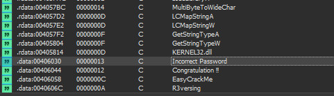
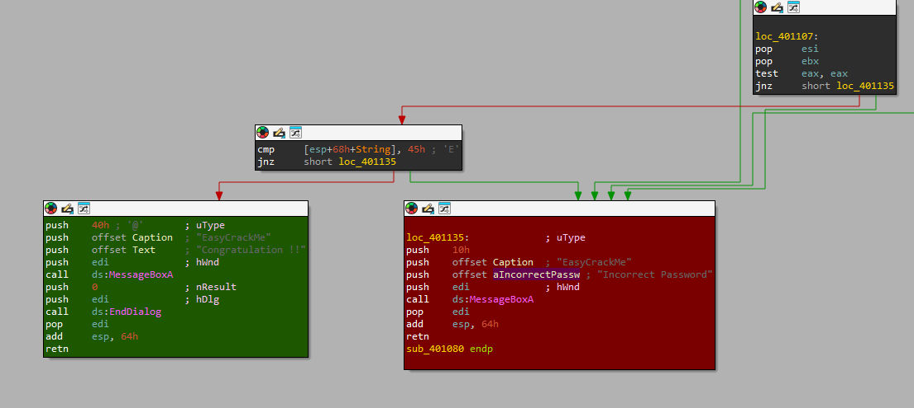

# WRITE-UPS

## Thực thi thử chương trình với chuỗi bất kỳ 

## Dùng IDA để tìm kiếm chuỗi password đúng 

- Nhấn Shift + F12 để tìm kiếm các chuỗi trong chương trình
- Tìm kiếm chuỗi ``Incorrect``.

- Đúp chuột vào chuỗi, IDA đưa ta đến vị trí của chuỗi ở ``.data``.
- Gõ X để tìm kiếm các nơi mà chuỗi được sử dụng.

- Đúp chuột vào ta sẽ đi đến nơi chuỗi dùng trong code.
- Ở này tôi thấy rõ 2 nhánh đúng và sai nên tôi tô màu để dễ nhìn.

- Nhấn F5 để nhìn tổng quan chương trình thì ta thấy có một chuỗi điều kiện password.

- Tham chiếu tới các biến ``Str2`` và ``aR3versing`` để xem các dữ liệu chứa trong đó.
- `strncmp(&String[2], Str2, 2u)` tức là so sánh chuỗi mà ta nhập ở bắt đầu ở vị trí thứ 2 với chuỗi `Str2` với độ dài kí tự là ``2``, tương ứng với ``strcmp(&String[4], aR3versing)``.
- Bắt đầu so khớp các chuỗi ta được một chuỗi Password như sau: ``Ea5yR3versing``.

## Nhập chuỗi vừa tìm vào Password và đã đăng nhập thành công 

---> Flag: ``Ea5yR3versing``