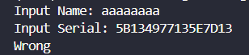
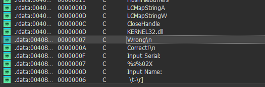
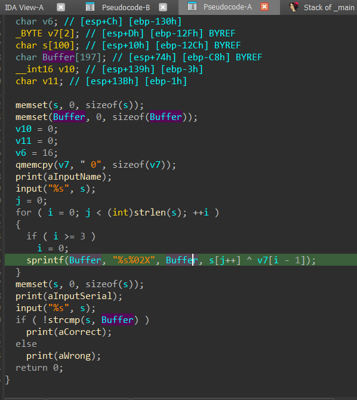
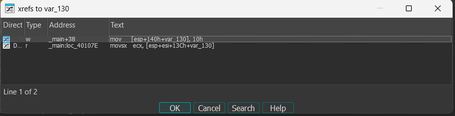
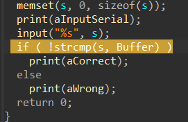

# WRITE-UPS

## EASY_CRACKME
### Thực thi thử chương trình với chuỗi bất kỳ 


### Dùng IDA để tìm kiếm chuỗi password đúng 

- Nhấn Shift + F12 để tìm kiếm các chuỗi trong chương trình
- Tìm kiếm chuỗi ``Incorrect``.


- Đúp chuột vào chuỗi, IDA đưa ta đến vị trí của chuỗi ở ``.data``.
- Gõ X để tìm kiếm các nơi mà chuỗi được sử dụng.


- Đúp chuột vào ta sẽ đi đến nơi chuỗi dùng trong code.
- Ở này tôi thấy rõ 2 nhánh đúng và sai nên tôi tô màu để dễ nhìn.


- Nhấn F5 để nhìn tổng quan chương trình thì ta thấy có một chuỗi điều kiện password.


- Tham chiếu tới các biến ``Str2`` và ``aR3versing`` để xem các dữ liệu chứa trong đó.
- `strncmp(&String[2], Str2, 2u)` tức là so sánh chuỗi mà ta nhập ở bắt đầu ở vị trí thứ 2 với chuỗi `Str2` với độ dài kí tự là ``2``, tương ứng với ``strcmp(&String[4], aR3versing)``.
- Bắt đầu so khớp các chuỗi ta được một chuỗi Password như sau: ``Ea5yR3versing``.

### Nhập chuỗi vừa tìm vào Password và đã đăng nhập thành công 


---> Flag: ``Ea5yR3versing``
---

## Easy Keygen

### Đọc nội dung trong file README

```
ReversingKr KeygenMe


Find the Name when the Serial is 5B134977135E7D13
```
- Ta thấy có một chuỗi số là `5B134977135E7D13`.

### Thực thi chương trình



- Nhập tên bất kỳ, với serial đã cho ở trước đây.
- Lúc này kết quả được in ra `Wrong`.

## Dùng IDA để phân tích

- Điều đầu tiên khi bật IDA, ta nhấn tổ hợp phím shift + F12 để tìm chuỗi Wrong.



- Ta truy vết đến nơi sử dụng chuỗi.


- Lúc này ở đây đã có luồng rõ ràng nên ta đổi màu để dễ quan sát.

- Nhấn F5 để xem tổng quát đoạn code này và bắt đầu phân tích ở những điểm quan trọng.



- Ta thấy có một phép toán được sử dụng và lưu vào buffer như trên.
Lưu ý: trong quá trình giải bài, tôi đã đổi tên các biến để dễ đọc nên sẽ không giống với chương trình gốc.

```
  for ( i = 0; j < (int)strlen(s); ++i )
  {
    if ( i >= 3 )
      i = 0;
    sprintf(Buffer, "%s%02X", Buffer, s[j++] ^ v7[i - 1]);
  }
```

- Đoạn code trên có nghĩa lấy từng kí tự từ chuỗi mà ta nhập vào xor với từng kí tự của v7 không quá, mỗi khi biến i = 3 thì sẽ được reset về 0.
- Ở đoạn này, tôi thấy khá cấn vì khi i = 0, thì ta sẽ truy cập đến v7[-1], vậy mà chương trình vẫn thực thi được ==> mấu chốt có thể ở đây.
- Đúp chuột vào v7 sẽ đưa ta đến stack, ta thấy `v7` là ``var_12F``, di chuột lên `var_130` và nhấn x để truy vết.



- Đúp chuột vào vị trí đầu tiên vì vị trí thứ 2 là ``v7[-1]`` lúc nãy.
- Ta thấy ta được đưa đến `v6`, vậy ``v7[-1]`` tức là ``v6``.
- phân tích đoạn sau ta thấy kết quả `buffer` cũng chính là `serial number` ta được cho trong README.



### Code để reverse InputName như sau

```!code
serial = bytes.fromhex('5B134977135E7D13')
v7 = b'\x10\x20\x30'

output = [chr(serial[i] ^ v7[i % 3]) for i in range(len(serial))]

print(''.join(output))
```
---> Flag: ``K3yg3nm3``.

